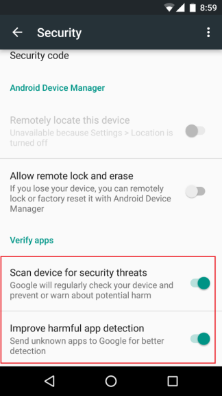

# Optional : Check for Indicators of Stalkerware Installation

Stalkerware are malicious applications used in the context of Intimate Partner Violence. One of the difference with classic android malware is that they are installed through a physical access to the smartphone. Because of this, the installation requires some changes on the Android system that can often be identified after.

## Check if Installation from Unknown Sources is Authorized

Stalkerware applications are installed directly from the application file (APK), which is by default forbidden by Android. To install the application, the person needs to allow the installation from Unknown Sources.

Before Android 8 "Oreo", this feature was for the entire phone. If you have a phone before Android 8, go to **Settings > Security** and check if **Unknown Sources** is enabled.

After Android 8, this feature is enabled or disabled per application. Go to **Settings > Biometrics and security > Install unknown apps** to see the list of applications allowed to install untrusted applications.

Any application in this list is suspicious, especially browsers.

## Check if Google Play Protect is Disabled

Google Play Protect is an automated detection of malicious applications developed and maintained by Google as part of their Google Play Services. This application is often disabled during the installation of a stalkerware because it can detect and remove the stalkerware application.

To check if this setting is disabled, you should check either in **Settings > Security > Scan Devices for Security Threats** or in **Settings > Security > Google Play Protect**.

## Check if the Phone is Rooted

See [this other part of this guide](root.md) to check if the phone is rooted.
